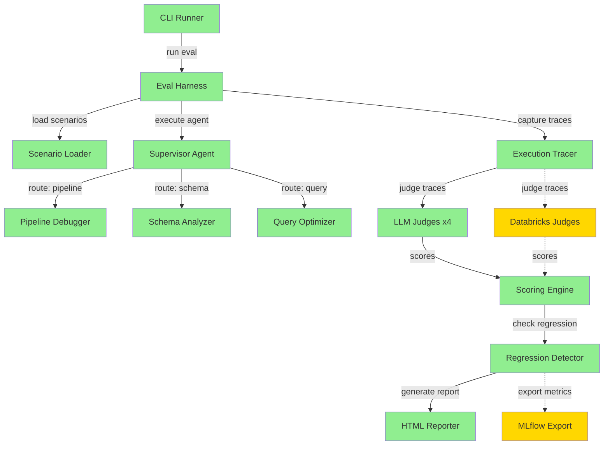

# databricks-agent-eval

> Databricks reports a 327% surge in multi-agent deployments. Their Mosaic AI Agent Evaluation catches single-agent issues. But who evaluates the supervisor when 4 agents are talking to each other?

A multi-agent evaluation harness that stress-tests supervisor-agent workflows using LLM judges, scoring rubrics, and regression detection. Compatible with MLflow 3 and Mosaic AI Agent Evaluation.

## Demo

https://github.com/hashwnath/databricks-agent-eval/raw/main/docs/demo.mp4

## Architecture



Green = live, working code. Yellow = scaffolded with clean integration points.

## What's Live vs Blueprint

| Component | Status | Notes |
|-----------|--------|-------|
| Eval Harness Core | Live | Full orchestration loop |
| Correctness Judge | Live | LLM-as-judge with written rationale |
| Routing Accuracy Judge | Live | Tests supervisor routing decisions |
| Groundedness Judge | Live | Checks output grounded in context |
| Cost Efficiency Judge | Live | Token/cost tracking per scenario |
| Custom Judge Builder | Live | Define judges in natural language |
| Databricks-Specific Judges | Scaffolded | guideline_adherence, chunk_relevance, context_sufficiency - interfaces match databricks-agents SDK |
| Scoring Rubric Engine | Live | Configurable weights per judge dimension |
| Regression Detector | Live | Baseline comparison with threshold alerts |
| Scenario Generator | Live | YAML/JSON scenario loading + built-in templates |
| Supervisor Agent (sample) | Live | 3-agent data engineering supervisor |
| HTML Reporter | Live | Self-contained dark-mode report with dimension charts |
| Console Reporter | Live | Rich terminal output |
| MLflow Export | Scaffolded | Interface matches MLflow 3 trace schema |

## Why This Matters

The "Supervisor Agent" architecture now accounts for 37% of enterprise agent deployments (Databricks 2026 State of AI report). But evaluation tooling hasn't kept up with multi-agent complexity.

Weights & Biases shipped Weave for LLM app evaluation. Arize (Databricks partner) launched production LLM observability. LangSmith built eval workflows for LangChain agents. The pattern is clear: every major AI platform needs purpose-built evaluation. This harness addresses the gap for multi-agent supervisor workflows specifically.

## Quick Start

```bash
# Clone and install
git clone https://github.com/hashwnath/databricks-agent-eval.git
cd databricks-agent-eval
pip install -r requirements.txt

# Set your OpenAI API key (used by judges and sample agent)
export OPENAI_API_KEY=sk-...

# Run evaluation on basic routing scenarios
python -m src.eval.cli --scenarios scenarios/basic_routing.yaml --agent sample

# Run with regression detection against a baseline
python -m src.eval.cli \
  --scenarios scenarios/complex_pipeline.yaml \
  --agent sample \
  --baseline baseline_scores.json \
  --output eval_report.html

# Console-only output (no HTML)
python -m src.eval.cli \
  --scenarios scenarios/basic_routing.yaml \
  --agent sample \
  --console-only
```

### Run Tests

```bash
PYTHONPATH=. pytest tests/ -v
```

32 tests, all passing.

### Programmatic Usage

```python
import asyncio
from src.eval.harness import EvalHarness
from src.eval.judges import (
    CorrectnessJudge,
    RoutingAccuracyJudge,
    GroundednessJudge,
    CostEfficiencyJudge,
    CustomJudge,
)
from src.agents.supervisor import SupervisorAgent

# Create judges
judges = [
    CorrectnessJudge(),
    RoutingAccuracyJudge(),
    GroundednessJudge(),
    CostEfficiencyJudge(),
    CustomJudge(
        name="conciseness",
        criteria="Response should be under 200 words and technically precise",
    ),
]

# Run eval
harness = EvalHarness(
    judges=judges,
    rubric_weights={"routing_accuracy": 2.0, "correctness": 1.5},
    baseline={"routing_accuracy": 0.875, "correctness": 0.9},
)

agent = SupervisorAgent()
result = asyncio.run(harness.run(agent.run, "scenarios/complex_pipeline.yaml"))

print(f"Pass rate: {result.pass_rate:.0%}")
print(f"Regressions: {len(result.regressions)}")
```

### Databricks Integration (Scaffolded)

```python
# Wire in Databricks-specific judges (requires databricks-agents SDK)
from src.eval.judges.databricks import (
    GuidelineAdherenceJudge,
    ChunkRelevanceJudge,
)

# These return scaffolded results until you install databricks-agents>=0.9.0
# and configure DATABRICKS_HOST + DATABRICKS_TOKEN
judges.append(GuidelineAdherenceJudge(guidelines=["Be concise", "Cite sources"]))
judges.append(ChunkRelevanceJudge())

# Export to MLflow (scaffolded)
from src.eval.reporters.mlflow_export import MLflowExporter
exporter = MLflowExporter(experiment_name="my-agent-eval")
exporter.export(result)
```

## About

Built by [Hashwanth Sutharapu](https://github.com/hashwnath) - contributor to
[Microsoft Agent Framework](https://github.com/microsoft/agentframework) (8K+ stars) and
[awesome-copilot](https://github.com/pnp/awesome-copilot) (29K+ stars).
Built ThinkNet, an 8-agent LangGraph deep researcher on AWS Bedrock.
SDE at MAQ Software (Microsoft Partner), Bellevue WA.
